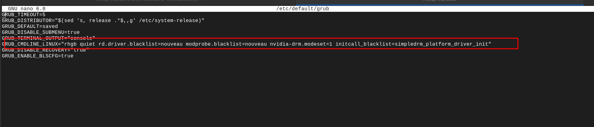

# Kernel Printk

# Understanding `LOG_BUF_LEN`

`LOG_BUF_LEN` is a kernel configuration parameter in Linux that determines the size of the `kernel’s log buffer`. 
- The kernel’s log buffer is a ring buffer where kernel log messages (printk outputs) are stored. 

### Default Size

The default size of `LOG_BUF_LEN` can vary depending on the kernel configuration and the platform it is running on.
- Typically, it can range from `16KB to 1MB`, but it might be configured to be larger on systems that require extensive logging.

### Configuration

You can configure the `LOG_BUF_LEN` size during kernel compilation by modifying the kernel configuration, usually done by manipulating the `.config` file or by using kernel configuration tools like `menuconfig`.

```sh
make menuconfig
```

Then navigate to Kernel hacking → Kernel log buffer size (16 => 1MB, 17 => 2MB).

### Usage

`LOG_BUF_LEN` is crucial when debugging and analyzing the kernel. If the buffer size is too small, older messages might be overwritten by new ones before you have a chance to read them.

To read the kernel log messages, you can use the `dmesg` command.

```sh
dmesg
```

### Adjusting at Boot

Some Linux distributions allow you to adjust `LOG_BUF_LEN` at boot time by passing it as a kernel parameter.

```sh
log_buf_len=size
```

This can be added to the kernel command line, typically found in the boot loader configuration file, like `grub.cfg`.


- Adjusting kernel parameters, including `LOG_BUF_LEN`, at boot time on Fedora (or similar distributions) is typically done by modifying the GRUB2 boot loader configuration. 
- The `log_buf_len` parameter controls the size of the kernel log buffer, and adjusting it may be necessary for debugging or other purposes.

### Steps to Adjust `LOG_BUF_LEN` at Boot Time in Fedora

#### Step 1: Edit GRUB2 Configuration
Open the GRUB2 configuration file using a text editor. Make sure to use `sudo` to have the necessary permissions.

```bash
sudo nano /etc/default/grub
```

#### Step 2: Modify Kernel Parameters
Find the line starting with `GRUB_CMDLINE_LINUX` and add your parameter `log_buf_len=size` at the end of the existing parameters. Ensure you replace `size` with the desired buffer size.

For example:

```bash
GRUB_CMDLINE_LINUX="rd.lvm.lv=fedora/root rd.lvm.lv=fedora/swap rhgb quiet log_buf_len=1M"
```




#### Step 3: Regenerate GRUB2 Configuration
Regenerate the GRUB2 configuration file to apply the changes.

For BIOS systems:

```bash
sudo grub2-mkconfig -o /boot/grub2/grub.cfg
```

For UEFI systems:

```bash
sudo grub2-mkconfig -o /boot/efi/EFI/fedora/grub.cfg
```

#### Step 4: Reboot System
Finally, reboot your system to apply the changes.

```bash
sudo reboot
```

### Note:

- Ensure to replace `size` with the actual size you want for the log buffer, e.g., `1M` for 1 Megabyte.
- Be cautious while modifying boot parameters as incorrect configurations could lead to boot issues.
- Always make sure to have a backup or recovery option (like a bootable USB drive with a Linux distribution) available in case something goes wrong.

This method allows you to adjust `LOG_BUF_LEN` during the boot process, which can be useful for capturing early log messages from the kernel. Always ensure to test configurations and understand the implications of kernel parameter adjustments to avoid system stability issues.


### Importance

Adjusting the size of `LOG_BUF_LEN` is essential in systems that require keeping extensive logs for debugging or analysis, ensuring that critical log information is not lost due to buffer overruns.


### Conclusion

Understanding and correctly configuring `LOG_BUF_LEN` is vital for kernel developers and system administrators alike. A properly sized log buffer ensures that essential kernel messages are retained and available for analysis, aiding in efficient debugging and system optimization.


